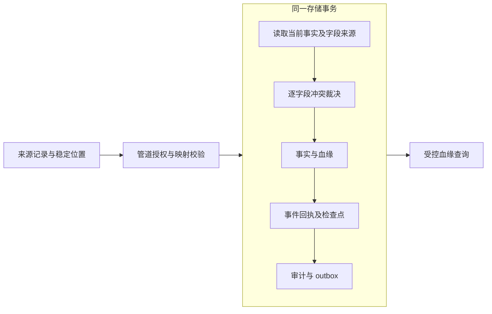

# Foundry事务血缘与可恢复同步

日期：2026-09-28。Foundry提交：`619c5aa`。完整核心覆盖目标继续。

## 本阶段结果

对象和关系的字段变化现与来源记录同事务提交。Action、同值人工确认及失败补偿带有真实来源标识；null、字段缺失、删除与恢复可以区分。普通字段更新不会覆盖受保护的对象存在断言，旧数据缺失的来源不会被自动编造。

对象同步已实际使用字段血缘执行三种冲突策略，并将来源事件回执、分区检查点、事实、审计和outbox放入同一事务。失败立即停止当前流；重试/重启不会越过坏记录，同一事件可由另一个授权工作进程重放。

同步默认拒绝，需显式接入SyncAuthorizer。公开血缘入口为Java API及REST `/api/v1/{type}/{id}/lineage`，同时要求实体/字段权限、Consent与can_view_lineage。来源记录指针、任意扩展资料和函数输入引用不经此公开接口输出。

## 一致性与升级

SOURCE_PRIORITY同级回退时间比较，ACTION_PRIORITY根据真实来源种类保护人工值；低优先级来源报告同一值也不能夺走原来源控制权。删除和恢复整体裁决，恢复沿用ID并通过当前约束/唯一性校验。不存在对象的删除消息可保存缺席断言，阻止迟到数据重新创建该身份。

有SourcePosition或sourceVersion的事件有稳定回执；已识别重复事件不重做事实，无记录的旧位置拒绝。检查点绑定分区来源、映射和冲突配置。无位置、无版本的输入仍是快照，不能宣称具备可靠CDC排序。

旧数据来源缺失时默认阻止首次改变；采用TRUST_UPDATED_AT或迁移建立新观测是显式选择。新增元数据表不重写旧历史。扩展Provider需实现并声明transactionalLineage/transactionalIngestion；同步宿主需要配置授权，OpenFGA模型需显式授予can_view_lineage才能使用公开血缘读取。

## 验证

全仓回归797项通过；随后新增来源优先级最大值边界测试，并定向复核同步与独立进程恢复。当前测试集 **798项**，其中Foundry **688项**，全部通过，无失败/错误/跳过。本阶段新增73项。

覆盖memory/H2、Action/补偿、同值和null保护、字段与生命周期来源、旧数据/未知删除、敏感元数据/Consent/分页、模型切换、配置变化、来源去重与乱序、失败停点、唯一性恢复、SQL故障回滚、单连接池和真实JDBC/HTTP取数。独立JVM验证物理提交前/后退出恢复，以及两个不同操作者竞争一个来源事件只产生一份事实/回执。

独立探针两种Provider结果一致：人工值保留、来源链ACTION/SYNC、重复事件重放一次、坏记录后检查点停在2且后一条未入库、独立元数据权限生效、公开源指针隐藏；其他既有探针无语义退化。

## 尚未完成

完整映射DSL/变换及关系同步、连接器生命周期/发现/真实增量提取/CDC解码/背压、overlay/writeback、调度和死信、函数依赖血缘、GraphQL血缘及实际PostgreSQL/国产库验收仍在计划中。现有JDBC/REST read仍是快照接口；本阶段提供可靠的提交和恢复契约，并未替代增量适配器。

运行中的Mirror库和服务JAR未改动。完整契约见[ADR-0029](../../../foundry/spec/adr/0029-transactional-lineage-and-ingestion.md)。
