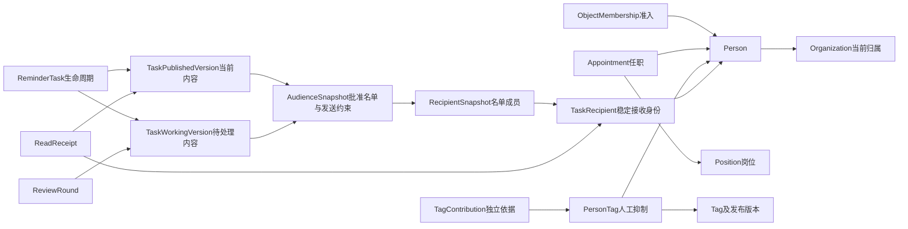

# Mirror Domain Pack 1.0.0（修订确认稿）

可执行定义位于 [src/main/resources/domain-pack/](../../src/main/resources/domain-pack/)，随应用打包；本说明在业务文档目录维护。

Pack定义Mirror需要保存和追溯的业务事实，不实现业务服务。依据是两份DOCX和已讨论的领域边界；XLSX只是数据形态参考，没有作为字段、表结构或状态枚举的模板。

本次在确认稿中修改人员准入、岗位属性归属、标签抑制、版本关系、提醒状态和名单复用。版本号仍为未发布的1.0.0确认稿，不表示生产兼容升级。旧应用未恢复，旧数据库未改动。

## 四组领域事实

| 文件 | 核心内容 | 为什么需要 |
| --- | --- | --- |
| [foundation.odl](../../src/main/resources/domain-pack/schema/foundation.odl) | Person、ObjectMembership、Organization、Position、Appointment、ProfileReference、ExternalIdentity、DataIssue | 分清自然人、业务准入、单位、任职和来源身份，不把一个来源账号状态等同于整个人的业务资格 |
| [tags.odl](../../src/main/resources/domain-pack/schema/tags.odl) | Tag及发布版本、策略及发布版本、PersonTag、独立贡献、评估批次/结果和AI建议 | 分清事实、规则判断、人工抑制和证据；一个来源结束不删除其他来源 |
| [supervision.odl](../../src/main/resources/domain-pack/schema/supervision.odl) | 事项、阶段、人员参与、风险线索 | 支持因事画像和阶段性提醒，保留多人参与与风险关联，不复制外部行权流程 |
| [reminders.odl](../../src/main/resources/domain-pack/schema/reminders.odl) | 示例/版本、媒体、任务/内容版本、AudienceSnapshot、逐人名单快照、审核、投递/阅读/撤回/逾期证据 | 明确谁批准什么内容、当时为何选人、每人的真实结果；内容修订不改变原名单及期限 |

## 人员身份与准入

Person只表示自然人及基础属性。姓名、联系方式、出生日期等可以更正，身份证号不作主键；个人职级为personalRankCode，和Position.positionGradeCode分开，前者的来源保留为personalRankSourceRef。

ObjectMembership通过MembershipPerson与Person一对一，记录Mirror当前准入决定及原因、操作人、时间和来源依据。PENDING表示尚未确认，IN_SCOPE表示纳入，EXCLUDED表示明确排除，SUSPENDED表示因权威停用等原因暂停新业务。一个渠道身份停用不会自动改变准入；恢复也不清除人工标签抑制。缺少准入记录不能默认开放业务。缺档案、缺生日等局部问题不自动把已纳入人员排除。

ExternalIdentity只保存已确认自然人的外部身份映射与该来源状态。运维/接口账号留在身份或接入服务，不造Person，也不挤进本体形成另一套账号管理。非对象账号清单可在接入层展示；已确认自然人的业务排除则通过ObjectMembership留痕。

PersonCurrentOrganization是权威当前归属；Appointment记录任职，兼任通过多个Appointment表达。任职身份与管理范围使用有来源的appointmentRoleCode/managementScopeCode，不直接存推算的“一把手”结论。证据不足为未知；具体分类由Mirror规则服务决定。

## 标签当前值是计算结果，人工抑制是独立决定

Tag保存稳定身份及启停开关，末级节点由TagParent推导，不维护另一份leaf权威标志。目录无环、最多三级及仅末级赋标由Mirror校验。

PersonTag每(person,tag)一个稳定关联，保存suppression=NONE/SUPPRESSED。NONE仅表示没有人工抑制，并不表示标签有效。当前有效标签须同时满足：ObjectMembership为IN_SCOPE、权威当前组织有效、目录启用且为末级、存在适用的已发布版本、suppression为NONE，并有至少一条适用期内ACTIVE贡献。结果可物化为可重建查询投影，但不能把缓存当另一份事实。

TagContribution保存MANUAL/RULE/AI_REVIEW/MATTER/RISK来源。某规则不再命中或阶段结束只结束相应贡献；UNKNOWN/CALL_FAILED的处理按待确认口径，不伪装成否定结论。人工删除只置抑制，自动重算不能清除；人工再次添加清抑制并记录新的人工依据。

## 草稿、发布版本和当前关系

标签定义、策略与内容示例的编辑草稿放在Mirror持久配置工作区，带draftId、编辑版本、权限、基础版本和预览证据。未发布的新建条目只存在工作区；发布时才创建稳定根/不可变语义版本及关联，必要时允许为已有根暂存下一版草稿。草稿有保存/审计责任，但无需为了每次编辑都发布本体事实。

TagVersion、TagPolicyVersion、ContentVersion均为发布后不可变语义版本。TagCurrentVersion、PolicyCurrentVersion、ContentCurrentVersion选择当前版本，VersionOf关系说明归属；服务必须验证同根。切换当前版本结束旧边、建立新边，历史不丢失。启停开关与当前版本选择是不同事实。

ReminderVersion是任务内容草稿，保存后可编辑，提交后state=FROZEN。审核结果在ReviewRound，发布在TaskPublishedVersion，待处理版本在TaskWorkingVersion。草稿/冻结、审核结果、当前发布和任务生命周期分别表达，没有一个总枚举覆盖所有组合。冻结后更改形成新内容版本；撤回本轮审核不解冻旧证据。

## 名单及发送约束独立冻结

选人工作区保存组织、标签ANY/ALL、指定人员和持久排除；确认后提交时创建AudienceSnapshot，固定selection、摘要、发送方式/计划时间、阅读时限及确认记录。RecipientSnapshot保存该名单中的姓名、单位和选人依据，SnapshotAudience指向名单，SnapshotRecipient指向稳定TaskRecipient。

VersionAudience将内容版本与其审核名单关联。首轮审核通过后TaskApprovedAudience固定，之后内容修订只复用这份快照，不复制整份名单，不重算当前标签，不更换时限。初次批准前调整名单或计划时间可创建新名单快照；批准后要换接收范围/时限则新建任务。已批准未发送的定时任务可以按业务规则取消。

TaskRecipient按(task,person)稳定；它是否进入正式发送范围，由批准名单成员决定，不按所有准备过程中产生的接收记录并集发送。修订发布不重发已成功消息，不重置首次成功时间。尚未成功的原发送意图仍引用原批准内容和同一名单；发布指针可独立前进。

图仅表示业务联系，实际关系名称/方向以ODL为准；列表成员通过SnapshotAudience反向查询。

## 并行状态与业务证据

ReminderTask.lifecycle仅OPEN/CANCELLED/CLOSED。“待审核”“部分送达”“撤回中”等页面状态由Mirror按版本、审核与逐人结果计算，允许同时显示多个维度。CLOSED表示明确结束新操作的业务决定，不因全员已读或全部送达自动关闭。

DeliveryAttempt和WithdrawalAttempt是一项有稳定请求身份的业务尝试，网络重传必须复用它；只有明确发起新的业务重试才另建尝试。响应证据不可变保存，原始报文、连接错误和worker重试日志放运行存储。单人Withdrawal没有PARTIAL_FAILED，部分撤回是多人或多个渠道请求的聚合视图；如果一个撤回需多个目标请求，未全部完成则保持PROCESSING/UNKNOWN或FAILED并保留各请求结果。

ReadReceipt按(recipient,version)唯一保存首次阅读；当前阅读从TaskPublishedVersion判断，旧版仅审计。逾期依据本人首次真实成功+AudienceSnapshot.deadlineHours，期限已固定，改内容不延长；OverdueEpisode保留产生及解除事实。DataIssue只收需业务处理的关联/评估/对接不一致问题；普通HTTP错误不全量转为领域对象。批次汇总、投递总数、阅读率和重试次数均是查询投影。

## 原子Action与Mirror流程

Pack现登记14个可执行事务Action：人员/组织/岗位/任职登记、准入决定、当前组织转移、标签抑制/人工赋标、事项参与、风险登记、审核决定、首次阅读：准入决定、当前组织转移、标签抑制、已有标签关联的人工贡献、事项参与登记、未匹配风险登记、审核决定、首次阅读。它们都有真实Manifest和必要关系导航，而非空effects或只列命令名称。

复杂Mirror流程不登记到Foundry。Mirror计算、等待人工、调用外部系统并编排已注册的Action；必要的全有或全无变更必须封装进同一Action。首次标签关联已由AssignManualTag承载，动态名单冻结等后续边界仍待实现，不能把多次独立提交当成一个事务。具体目录、部署所需授权策略、缺口及安全验收见[Action边界](action-boundaries.md)。

## 分层与验证

Foundry提供模型/关系历史、约束、事务、Action执行和成功审计/outbox。Mirror提供业务算法、身份与组织授权、工作流与异步任务。ActionAuthorizer是可信扩展点，默认拒绝；没有Mirror策略时不开放这些Action。当前底座没有之前文字描述的任意Java Handler注册机制或共享事务Action批量入口。

[业务自述](mirror-business.md)、[服务边界](service-boundaries.md)、[结构契约](payload-contracts.md)是配套定义。当前实现与验证见[开发进度](../development/progress.md)，旧底座核查保留在[历史归档](../archive/remodel-review-20260928/foundry-readiness.md)。

在仓库根目录运行 `mvn test -DskipFrontend=true -Dtest=DomainModelTest,DomainActionTest` 可验证模型和真实Action执行。模型测试中的授权器只验证底座钩子，应用服务与真实权限的验证另见[开发进度](../development/progress.md)。
