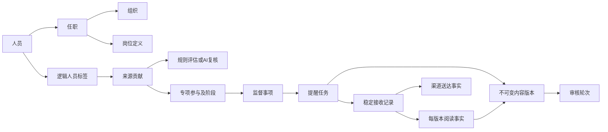

# 政务对象库业务 Domain Pack · 0.2.9

本包定义政务对象库的业务事实、关系、动作与约束，覆盖《试点工作方案》及《软件需求规格说明书》的业务要求。它不沿用文档中的既有明镜技术栈、服务器品牌、页面菜单或数据库表设计，也不宣称完整系统已经实现。

本次交付是**定义完善**。部分Java处理器已接通，但新增定义并不自动获得执行能力；具体以运行契约登记为准。

当前定义包括 **53个对象类型（含3个技术支持类型）、118个关系类型、71个业务动作契约**。统计用于说明定义规模，不作为实现完成度。

## 如何阅读

| 文件 | 内容 | 当前运行时支持 |
| --- | --- | --- |
| `pack.yaml` | 命名空间、版本、模型文件与契约索引 | Foundry加载schema列表；x-扩展仅供定义验证 |
| `schema/domain.odl` | 原有人员/组织、标签、内容、任务、回执模型及兼容字段 | 可解析、编译和应用到Provider |
| `schema/business-evidence.odl` | 档案投影、来源贡献、专项事项、选人、审核与阅读版本关系 | 可解析、编译和应用到Provider |
| `schema/runtime-support.odl` | 命令回执、写入锁及规则评估游标技术对象 | 保留原型兼容，不是政务业务概念 |
| `contracts/action-types.odl` | 全部业务动作的类型化输入签名 | 与对象schema合并后可由ODL编译；未注册到执行列表 |
| `contracts/actions.yaml` | 操作者、权限、前置条件、效果、幂等、事件、输出 | 定义专用格式；不是Foundry effect YAML |
| `contracts/rules.yaml` | 业务不变量、唯一性规则与文档冲突处理 | 需业务执行层落实，当前非自动策略引擎 |
| `contracts/states.yaml` | 状态词表和关键迁移 | 需业务处理器校验 |
| `contracts/metrics.yaml` | 人数/人次、分子分母、时间/版本/权限口径 | 查询契约，非预填统计数据 |
| `contracts/tag-catalog.yaml` | 对照试点附件4的初始标签词表和赋标方式建议 | 定义样例，不自动写入运行库 |
| `contracts/scenarios.yaml` | 关键业务验收场景与期望 | 是验收规格，不冒充已通过的端到端测试 |
| `contracts/coverage.yaml` | 需求书39项功能编号＋试点3类专项/治理要求对照 | 结构测试检查无遗漏及引用一致性 |

`actions: []` 是有意的：当前Foundry执行器仅支持简单对象/关系效果，不能表达冻结快照、独立审核、条件重算、外部回执等完整业务动作。为避免不带业务校验的命令进入执行入口，旧 `actions/transfer-assignment.yaml` 仅作为历史示例保留，不再注册。71个动作已经有签名和契约，不应把它们当成71个已可调用接口。后续落实处理器后逐个提升为可执行动作，而不是填写空effects来使Loader通过。

## 业务主线



### 人员与组织

- Person为稳定人员身份；UserAccount为权限主体，可关联人员，但非对象账号仍可存在且不能参与画像/提醒。
- PersonProfile存受控档案投影与可用字段、来源版本，不复制整个上游档案系统。身份证/手机号采用受保护引用，字段实际值在受权服务中解析。不得把工号当作渠道身份。
- 人员当前归属来自明确权威来源；Assignment通过AssignmentUsesPosition关联岗位，兼任和历史均可表达。
- OrganizationParent的树无环与“一人恰有一个当前组织”是业务约束；MANY_TO_ONE只代表最多一个，不能替代存在性和有效期校验。
- 分类映射独立于组织主数据，单位性质继承及职务层级优先级由ClassificationMapping表达。

组织与授权另有`SynchronizeOrganizationFacts`和`SynchronizeAccountAuthority`契约：无人组织也可独立调整层级；账号不必关联人员。当前权限根据组织树、账号状态和有效授权重新判断，旧会话不能保留已撤销权限。来源系统可以替换，不要求已有明镜账号或组织实现。

### 标签、贡献与依据

- `(tenant, personId, tagDefinitionId)`唯一一条PersonTagAssignment表示逻辑标签。
- TagContribution记录人工、规则、经复核AI或专项来源。规则失效只结束自己的贡献，不能删除其他来源。
- manualSuppressed对整个逻辑标签生效。自动规则、重新启用、AI复核不能解除；只有显式人工恢复可以。
- TagEvaluation与TagProcessingIssue可以在从未成功赋标时存在，关联人员、具体标签/规则、批次、输入摘要；不强制先有人员标签。
- TagVersion、RuleVersion、AiPolicyVersion冻结定义/规则/提示词配置。历史推送引用当时版本，不能随更名或规则修改漂移。
- TagCandidate明确关联人员、标签版本、策略、输入依据与批次，确认时验证是否过时。

### 因事专项

SupervisionMatter涵盖项目、资金、整改、节庆、任免、采购、换届等事项；Project是可选的工程项目细节。MatterStage描述具体阶段，MatterParticipation描述某人以经办/分管/参与等角色参与的有效区间。

专项贡献连到参与关系、阶段及风险依据。A事项结束只结束A贡献，不结束同一人的B事项贡献及长期性标签。RiskEvent是外部或人工登记的风险线索，不等于违纪结论，不在本包建设所有行权监督模型。

### 名单、审核与内容

RecipientSelection保存组合条件与修订号，SelectionEntry保存条件命中、显式指定、手工排除和资格结果；这些独立布尔值支持重叠计数。确认绑定摘要，重算不能清除手工排除。

ReminderTaskVersion是最终清洗内容、链接、图片摘要/副本、时限、名单、标签依据的冻结快照。ReviewRound独立保存每轮提交/决定人、单位、时间和快照摘要。内容安全检查和逐图确认绑定版本摘要。待审修订与当前发布版同时存在，不能以一个snapshotId混淆。

### 稳定接收与版本阅读

RecipientRecord按`任务＋人员`唯一，直接连接任务与人员；不因内容修订重建。firstDeliveredAt和deadlineAt只在首次真实送达成功后设置，修订/后续重试不延长。

VersionTargetsRecipient改为多对多，是每个冻结版本对稳定接收名单的引用。RecipientVersionState按`接收记录＋内容版本`唯一，ReadReceipt同键首条有效；送达、撤回状态独立于阅读状态。允许“送达未知但本人已阅读”，同时记录对接不一致。

OverdueRecord针对接收记录和发布版本，并保留产生时主管组织；当前督促范围按当前人员归属判断。真实新版阅读解除当前逾期，修订/撤回关闭旧记录只记关闭原因，不冒充已读。

## 定义边界与未决项

详见rules.yaml中的冲突表：

- 试点方案需要专项阶段标签，需求书3.2.1首期只含长期性目录；保留`pilot-extension`定义，不擅自宣称首期实现范围扩张。
- 当前按3.5.1采用鹿路通唯一触达、H5记录本人阅读，暂不自动短信；5.2第7条另有“短息接口”要求，冲突待明确。此前称该条款不存在的复核结论错误。
- 非对象标记是独立权限，默认仅超级管理员，下放待确认。
- 阅读率给出送达者阅读率和全目标覆盖率两种明确口径；UI不能混淆。
- 党委/纪委/职能部门的责任分工不是三个硬编码角色，也不是三套内容库；用组织责任类型、任务归属和授权表达。

时间、授权、幂等和审计为共用执行契约。JSON承载可变业务快照不意味着允许任意脚本；结构规则见 `contracts/payloads.md`。数据库布局、消息中间件、身份票据协议、服务部署不由业务Pack规定。

## 验证与迁移

```bash
mvn -pl business-verification -am test
```

验证包加载、契约引用与动作签名、需求编号覆盖、状态迁移动作引用、初始目录层级，以及“同人员多候选/同标签多内容/两事项贡献/同接收人跨版本”的模型可表达性。测试不证明真实授权、规则引擎、渠道或UI全部实现。

0.2.0改变关系基数和接收记录语义，不能直接宣称无损在线升级。现有数据库须先备份，按 `MIGRATION.md` 评估、迁移和验收。定义文件变更不会自动迁移生产数据；运行层接通情况以运行契约登记和逐阶段验证记录为准。

定义复核修订0.2.2及其业务依据见 [再验证报告](../business-spec/domain-pack-review.md)。

Mirror应用已开始接入部分Java处理器，进度见 [运行契约登记](../business-spec/runtime-contracts.md)。包内`actions: []`仍仅针对当前Foundry YAML执行器；不能据此把71个业务契约都宣称为可执行。已接通的标签、提醒和统计子集也不意味着完整业务已经实现。

业务覆盖范围及Foundry责任边界见 [业务解读](BUSINESS-COVERAGE.md)。0.2.2补充独立组织/授权同步、专项退出及迟到回执状态、待处理人数口径，共23项业务验收场景；场景定义不等于已执行验收。

0.2.3补充SaveReminderRevision及独立revisionState，明确修订草稿确认→独立审核→持久发布的准备阶段；当前共24项验收规格。该状态与任务送达汇总分开，避免修订把已发送任务改回草稿。

0.2.4补充撤回作业派发契约、原始回执与有效结果区分、撤回取消待发布修订，以及在途发送取消和按完整名单汇总的语义；当前68动作、26项验收规格。

0.2.5细化12项统计口径、权限快照与撤回历史筛选，并在VersionTargetsRecipient上冻结逐人标签版本。该版68个动作、28项验收规格。

0.2.6补充CreateTagRule和规则评估游标，声明SKIPPED以及无法计算时仅暂停本规则贡献的策略；后台批次逐项保存评估/问题/来源及进度。

0.2.7补齐映射预览证据及确认发布契约、规则独立停用和重新启用链路。当前53对象、118关系、71动作、31项验收规格；新增映射/停用契约未接通运行处理器。UNKNOWN贡献策略标为业务假设，不把实现选择冒充原文要求。

0.2.8细化规则停用清理：批次冻结贡献和问题ID、当前有效查询即刻排除停用来源、问题关闭保留原因、新旧发布隔离及重启恢复。当前32项验收规格，DeactivateTagRule已接通；映射预览/发布仍待实现。

0.2.9补充已有Person.title只读职务摘要字段，适配Foundry严格属性校验；规则识别仍读取Assignment/Position标准事实，不使用该摘要猜测岗位。演示初始化和规则赋标补齐实际关联时间，原型/测试补齐声明的必要字段，不改变数据底座与业务层边界。
